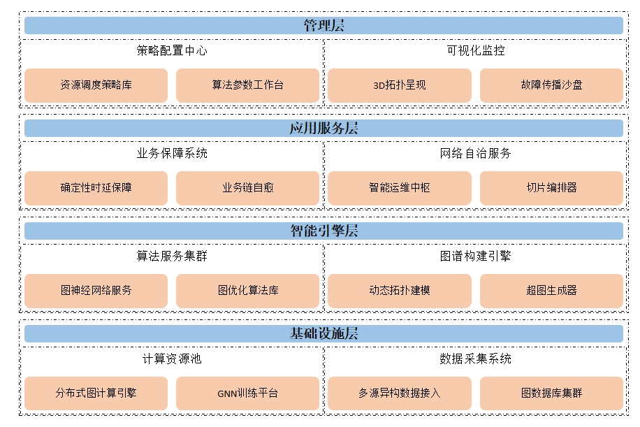

# 效果预览：


# 功能：
给定一段markdown，生成对应的系统架构图。
对应的markdown格式如下：
```markdown
# 一级标题
## 二级标题
### 三级标题
# 一级标题
## 二级标题
### 三级标题
```

# 特性：
1. 配置文件与代码分离，方便修改配置。
2. 支持样式主题配置

# 配置文件：

根目录下的config.toml文件，用以配置工作空间地址，各形状的大小等。

config.toml中的theme字段，用以配置主题。

# 主题配置：

主题配置文件位于根目录下的themes文件夹中。

